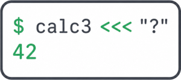

# Calc3 — учебный проект калькулятора на C3
Формальная цель проекта - написать грамматику, реализовать токенизатор и парсер.
Построить AST и органиовать обход дерева.
В одном случае - с целью вывести обратную польскую нотацию, в другом - вычислить значение выражения. 


Настоящая цель - изучить на практике язык C3, работу с LLMs (online и offline) на 
примере использования "свежего" языка программирования, для которого еще
(относительно) мало примеров в сети.

## Синтаксис калькуляттора

<!--💡 **Краткая напоминалка по EBNF.**-->
> [!NOTE] **Краткая напоминалка по EBNF.**
> * `{ X }` - 0 или более повторений `X`.
> * `[ X ]` - 0 или 1 повторение `X`.
> * `( X | Y )` - группировка альтернатив.
> * `,` - последовательность.
> * `;` - конец правила.
> * `(*...*)` - комментарий.

```ebnf
expr = term , { ( "+" | "-" ) , term } ;
term = factor , { ( "*" | "/" ) , factor } ;
(* 
*   Разрешен знак у factor.
*   В частности +0 == -0 == -(-0) == ... == 0.
*   Некрасиво, но корректно.
*)
factor = [ sign ] , ( integer_literal | "(" , expr , ")" ) ;
integer = ( non_zero_integer | "0" ) ;
non_zero_integer = non_zero_digit , { digit } ;
sign   = "+" | "-" ;
digit = "0" | non_zero_digit ;
non_zero_digit = "1" | "2" | "3" | "4" | "5" | "6" | "7" | "8" | "9" ;

```
```ebnf

expr = term , { ( "+" | "-" ) , term } ;
term = factor , { ( "*" | "/" ) , factor } ;
factor = integer | "(" , expr , ")" ;

integer = [ sign ] , ( non_zero_integer | "0" ) ;
non_zero_integer = non_zero_digit , { digit } ;
sign   = "+" | "-" ;
digit = "0" | non_zero_digit ;
non_zero_digit = "1" | "2" | "3" | "4" | "5" | "6" | "7" | "8" | "9" ;

```

# Сборка проекта
* Debug версия
  ```bash
  $ с3с build calc3
  ```
* Release версия
  ```bash
  $ с3с build calc3 -O1 -g0
  ```
* Запуск тестов
  ```bash
  $ с3с test calc3
  ```
# Структура проекта
```
calc3/
├── .github/workflows/
│   └── ci.yaml                 ── GitHub CI workflow
├── src/                        ── Исходный код
│   └── ...
├── test/                       ── Тесты
│   └── ...
├── project.json                ── Конфигурация проекта
...
```
# Ссылки для справки и изучения

- [https://c3-lang.org/](https://c3-lang.org/) - главная страница о C3. Там есть:
  - - [https://c3-lang.org/getting-started/introduction/](https://c3-lang.org/getting-started/introduction/) - документация.
  - [https://c3-lang.org/blog/](https://c3-lang.org/blog/) - блог.
- [https://github.com/c3lang/c3c](https://github.com/c3lang/c3c) - собственно, исходники c3c.
- [https://github.com/c3lang/c3c/tree/master/lib/std](https://github.com/c3lang/c3c/tree/master/lib/std) - исходники стандартной библиотеки.
- [https://deepwiki.com/c3lang/c3c/1-overview](https://deepwiki.com/c3lang/c3c/1-overview) - очень интересная wiki, есть много вещей, не вошедших в официальную документацию.
  

# Лицензия
Проект распространяется под лицензией MIT.
