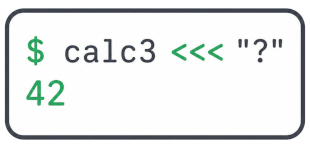

[English](README.md) | Русский | [中文](README.zh.md)

# Calc3 — учебный проект калькулятора на C3


<div style="clear: both;"></div>
<b>Формальная цель</b> проекта - определить грамматику, реализовать токенизатор и парсер.
Построить AST и организовать обход дерева.
В одном случае - с целью вывести обратную польскую нотацию, в другом - вычислить значение выражения.

---

**Настоящая цель** - изучить на практике язык C3, работу с LLMs (online и offline) на
примере использования относительно нового языка программирования, для которого еще
(относительно) мало примеров в сети.

# Сборка проекта

- Debug версия
  ```bash
  $ c3c build calc3
  ```
- Release версия
  ```bash
  $ c3c build calc3 -O2 -g0
  ```
- Запуск тестов
  ```bash
  $ c3c test calc3
  ```

# Пример ввода и вывода

Обмен с программой построчный: вводите выражение, получаете AST, обратную
польскую запись и вычисленное значение. Пример (задействованы все типы
операторов — `+ - * / %`, унарный минус и скобки):

```text
$ ./build/calc3
-(2 + 3) * 4 - 6 / 2 % 3
=== AST (Abstract syntax tree) ===
BIN(-) (1:14)
├── BIN(*) (1:10)
│   ├── UNARY(-) (1:1)
│   │   └── BIN(+) (1:5)
│   │       ├── NUM(2) (1:3)
│   │       └── NUM(3) (1:7)
│   └── NUM(4) (1:12)
└── BIN(%) (1:22)
    ├── BIN(/) (1:18)
    │   ├── NUM(6) (1:16)
    │   └── NUM(2) (1:20)
    └── NUM(3) (1:24)

=== RPN (Reverse Polish notation) ===
2 3 + NEG 4 * 6 2 / 3 % -

=== Result (Eval) ===
-20
```

## Использование из командной строки

Программа поддерживает несколько режимов запуска:

- `calc3` — интерактивный REPL: выражения читаются по одному на строку из stdin.
- `calc3 "<выражение>"` — вычислить одно выражение (выводятся AST, RPN и результат).
- `calc3 -f <файл>` или `calc3 --file <файл>` — выражения из файла (по одному на строку).
- `calc3 -h` / `calc3 --help` — справка.

Чтобы передать выражение, начинающееся с `-` (например, отрицательное `-5`),
используйте `--`: `calc3 -- "-5 + 8"`.

## Синтаксис калькулятора

```ebnf
expression = term, { ("+" | "-"), term } ;
term       = factor, { ("*" | "/" | "%"), factor } ;
factor     = { "+" | "-" }, primary ;
primary    = INTEGER | "(", expression, ")" ;

INTEGER    = digit, { digit } ;
digit      = "0" | "1" | "2" | "3" | "4" | "5" | "6" | "7" | "8" | "9" ;

```

## Пояснение структуры

|  Правило   |      Отвечает за      | Приоритет |               Ассоциативность                |
| :--------: | :-------------------: | :-------: | :------------------------------------------: |
| expression |    Бинарные + и -     |  Низкий   | Левая (естественно вытекает из { op, term }) |
|    term    |   Бинарные *, /, %    |  Средний  |                    Левая                     |
|   factor   |     Унарные + и -     |  Высокий  |                    Правая                    |
|  primary   | Атомы: числа и скобки |  Высший   |                      —                       |

# Текущее состояние

Проект реализует формальную цель: токенизатор, парсер, построение AST и обход дерева — как
для вывода обратной польской записи, так и для вычисления значения выражения.

- **Токены** — [src/token.c3](src/token.c3): типы токенов (число, операторы, скобки, конец ввода),
  значение токена и позиция в исходнике.
- **Лексер** — [src/lexer.c3](src/lexer.c3): разбирает текст на токены, пропускает пробелы, следит за
  позицией (строка/колонка), ловит переполнение целых и неизвестные символы. На ошибке
  лексер «дочитывает» проблемный фрагмент и возвращается в состояние, как будто готов
  продолжить разбор, — однако восстановление после сбоев пока не реализовано и даже
  не входит в планы.
- **AST** — [src/ast.c3](src/ast.c3): абстрактное синтаксическое дерево из узлов трёх видов —
  число, унарная и бинарная операция. Узлы умеют принимать визитора и печататься.
- **Визиторы** — паттерн Visitor для обхода дерева:
  - [src/ast.c3](src/ast.c3) — демонстрационный визитор для печати узлов;
  - [src/ast_tree.c3](src/ast_tree.c3) — `ast::to_tree()`: вывод AST в виде дерева (в стиле `eza -T`);
  - [src/rpn_visitor.c3](src/rpn_visitor.c3) — `ast::to_rpn()`: вывод в обратной польской записи
    (унарный минус — `NEG`, унарный плюс — `POS`);
  - [src/eval_visitor.c3](src/eval_visitor.c3) — `ast::eval()`: вычисление значения выражения. Возвращает
    `Result{int, EvalError}`: деление/остаток на ноль, целочисленное переполнение
    (включая `INT_MIN / -1` и `-INT_MIN`) дают ошибку вместе с позицией.
- **Парсер** — [src/parser.c3](src/parser.c3): рекурсивный спуск по грамматике (см. выше) с учётом
  приоритетов и ассоциативности; строит AST, поддерживает унарные операторы и скобки.
  Ошибки возвращаются вместе с описанием и позицией.
- **Точка входа** — [src/main.c3](src/main.c3): читает выражения из stdin и для каждой строки печатает
  RPN и вычисленное значение (или сообщение об ошибке). На ввод «?» отвечает числом 42.
- **Тесты** — [test/](test/): модульные тесты лексера, AST, парсера, eval и точки входа (67 тестов).
  Запуск: `c3c test calc3`.

Не планируется: восстановление лексера/парсера после ошибок.

# Структура проекта

```
calc3/
├── .github/workflows/
│   └── ci.yaml                    ── CI: сборка и тесты при push/PR в main
├── src/                           ── Исходный код
│   ├── token.c3                   ── Токены: типы, значение и позиция в исходнике
│   ├── lexer.c3                   ── Лексер: исходный текст → поток токенов
│   ├── ast.c3                     ── AST: узлы дерева, интерфейсы и фабрики
│   ├── ast_tree.c3                ── Визитор: AST → дерево (в стиле eza -T)
│   ├── rpn_visitor.c3             ── Визитор: AST → обратная польская запись
│   ├── eval_visitor.c3            ── Визитор: AST → значение выражения
│   ├── parser.c3                  ── Парсер: токены → AST (рекурсивный спуск)
│   └── main.c3                    ── Точка входа: чтение выражений из stdin
├── test/                          ── Тесты
│   └── *.c3                       ── Модульные тесты на каждый модуль src/
├── resources/
│   └── calc3_logo*.png             ── Логотип проекта
├── project.json                   ── Конфигурация и настройки сборки (c3c)
├── README.md                      ── Документация на английском
├── README.ru.md                   ── Документация на русском
├── README.zh.md                   ── Документация на китайском
└── LICENSE                        ── Лицензия MIT
```

# Ссылки для справки и изучения

- [https://c3-lang.org/](https://c3-lang.org/) - главная страница о C3. Там есть:
  - - [https://c3-lang.org/getting-started/introduction/](https://c3-lang.org/getting-started/introduction/) - документация.
  - [https://c3-lang.org/blog/](https://c3-lang.org/blog/) - блог.
- [https://github.com/c3lang/c3c](https://github.com/c3lang/c3c) - собственно, исходники c3c.
- [https://github.com/c3lang/c3c/tree/master/lib/std](https://github.com/c3lang/c3c/tree/master/lib/std) - исходники стандартной библиотеки.
- [https://deepwiki.com/c3lang/c3c/1-overview](https://deepwiki.com/c3lang/c3c/1-overview) - очень интересная wiki, есть много вещей, не вошедших в официальную документацию. **Самое главное** - там к поиску прикрутили (возможно, специально дообученную) **модель Devin**, и она очень хорошо отвечает на вопросы по языку и стандартной библиотеке C3. И deepseek, и chatgpt хорошие, но универсальные модели. Да и C3 знают так себе. А Devin на сайте все объясняет, при необходимости - прямо исходники показывает. Очень впечатлен.
- [https://github.com/c3lang/c3-showcase](https://github.com/c3lang/c3-showcase) - коллекция проектов на C3.
- [https://zed.dev/](https://zed.dev/) - Современная IDE, поставляется вместе с несколькими LLM - Free (или условно Free) моделями, отличается от VS Code сильно повышенной скоростью. Сама концепция VS Code более-менее похожая.

## Синхронизация переводов

Исходник документации — `README.ru.md`. Переводы `README.md` (английский) и
`README.zh.md` (китайский) должны ему соответствовать. Чтобы отслеживать
рассинхрон, в начало каждого перевода встроен скрытый HTML-комментарий
с sha256 от исходника:

```text
<!-- source-hash: sha256:<64 hex> -->
```

Скрипт `scripts/check_readme_sync` сравнивает текущий хэш `README.ru.md`
со встроенным в переводы. Режимы:
- (по умолчанию) — неблокирующая подсказка, всегда `exit 0`;
- `--update` — перезаписывает маркеры в переводах актуальным хэшем;
- `--strict` — падает (`exit 1`), если переводы не соответствуют исходнику
  (используется в CI как тест).

Последовательность при правке исходника:
1. Измени `README.ru.md`.
2. `git commit` — хук `pre-commit` напомнит (warning), но не заблокирует коммит.
3. Вручную обнови переводы `README.md` и `README.zh.md`.
4. Запусти `scripts/check_readme_sync --update`, чтобы обновить маркеры.
5. Проверь: `scripts/check_readme_sync --strict` (должно быть `OK`).
6. `git push` — CI-шаг `--strict` проверит соответствие.

Важно: маркер отражает только факт изменения исходника, а не качество
перевода; `--update` запускай только после реального обновления переводов.

# Лицензия

Проект распространяется под лицензией MIT.
