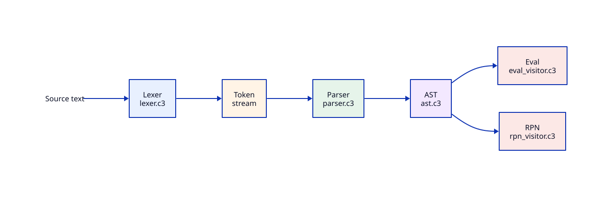

<!-- source-hash: sha256:ef21e375ed958b6200f8cf936ba97e90e5465eba5c13cc4349580f50e89f0eb8 -->
[English](README.md) | [Русский](README.ru.md) | 中文

# Calc3 — 基于 C3 语言的入门计算器项目


<div style="clear: both;"></div>
<b>正式目标</b>——定义文法、实现词法分析器（tokenizer）和语法分析器（parser），
构建抽象语法树（AST）并组织树的遍历。
一种情况——以输出逆波兰表达式（RPN）为目标；另一种情况——计算表达式的值。

---

**真正目标**——通过实践学习 C3 语言，练习使用 LLM（在线和离线），
以一个相对较新的编程语言为例，目前网上关于它的示例（相对）还很少。

# 构建项目

- 调试（Debug）版本
  ```bash
  $ c3c build calc3
  ```
- 发布（Release）版本
  ```bash
  $ c3c build calc3 -O2 -g0
  ```
- 运行测试
  ```bash
  $ c3c test calc3
  ```

# 输入输出示例

与程序的交互是逐行的：输入表达式，即可得到 AST、逆波兰表示法以及计算结果。
示例（涵盖了所有运算符类型——`+ - * / %`、一元负号和括号）：

```text
$ ./build/calc3
-(2 + 3) * 4 - 6 / 2 % 3
=== AST (Abstract syntax tree) ===
BIN(-) (1:14)
├── BIN(*) (1:10)
│   ├── UNARY(-) (1:1)
│   │   └── BIN(+) (1:5)
│   │       ├── NUM(2) (1:3)
│   │       └── NUM(3) (1:7)
│   └── NUM(4) (1:12)
└── BIN(%) (1:22)
    ├── BIN(/) (1:18)
    │   ├── NUM(6) (1:16)
    │   └── NUM(2) (1:20)
    └── NUM(3) (1:24)

=== RPN (Reverse Polish notation) ===
2 3 + NEG 4 * 6 2 / 3 % -

=== Result (Eval) ===
-20
```

## 示例：定义与调用函数

除算术外，计算器还支持用户自定义函数以及内置的 `ask()`。交互方式仍为逐行：
一行一条命令。

```text
fn int add(int a, int b) { a + b }
add(2, 3)
fn int fact(int n) { if (n <= 1) { 1 } else { n * fact(n - 1) } }
fact(5)
fn int sq(int n) { n * n }
let x = sq(add(2, 3))
x
ask() + 1
```

计算结果（`Result` 字段）：

| 输入 | 结果 |
|------|------|
| `add(2, 3)` | `5` |
| `fact(5)` | `120` |
| `x` | `25` |
| `ask() + 1` | 打印 `? `，返回输入的整数 `+ 1` |

函数头语法（前缀式，同 C3）：

```ebnf
function = "fn", Type, name, "(", [ Type, name, { ",", Type, name } ], ")", "{", expression, "}" ;
```

参数显式列出，并按值传递。目前仅支持 `int` 类型；参数个数不匹配会给出
`Argument count mismatch`，未知类型会给出 `Unsupported type '...'`。

## 命令行用法

程序支持多种运行模式：

- `calc3` — 交互式 REPL：从 stdin 逐行读取表达式。
- `calc3 "<表达式>"` — 计算单个表达式（输出 AST、RPN 与结果）。
- `calc3 -f <文件>` 或 `calc3 --file <文件>` — 从文件读取表达式（每行一个）。
- `calc3 -h` / `calc3 --help` — 显示帮助。

若要传入以 `-` 开头的表达式（例如负数 `-5`），请使用 `--`：
`calc3 -- "-5 + 8"`。

## 计算器语法

```ebnf
expression = term, { ("+" | "-"), term } ;
term       = factor, { ("*" | "/" | "%"), factor } ;
factor     = { "+" | "-" }, primary ;
primary    = INTEGER | "(", expression, ")" ;

INTEGER    = digit, { digit } ;
digit      = "0" | "1" | "2" | "3" | "4" | "5" | "6" | "7" | "8" | "9" ;

```

除算术外，语言中还有名字绑定（`let`）、函数的定义与调用（`fn`）以及内置的 `ask()`：

```ebnf
statement  = let_stmt | fn_stmt | expression ;
let_stmt   = "let", name, "=", expression ;
fn_stmt    = "fn", Type, name, "(", [ Type, name, { ",", Type, name } ], ")", "{", expression, "}" ;
call       = name, "(", [ expression, { ",", expression } ], ")" ;
primary    = INTEGER | "(", expression, ")" | name | call | "ask", "(", ")" ;
```

- `let <名字> = <表达式>` — 绑定在执行时于当前作用域求值；允许重新绑定。
- `fn <类型> <名字>(<类型> <参数1>, ...) { <函数体> }` — 前缀式函数头，同 C3；参数按值传递。目前仅支持 `int` 类型（未知类型会给出 `Unsupported type '...'`）。递归依靠临时调用帧实现。函数暂时**还不是一等公民**。
- 调用 `<名字>(<实参>, ...)` — 实参与形参个数不一致会给出 `Argument count mismatch`。
- `ask()` — 内置函数：打印 `? ` 提示符并从 stdin 读取 `int`。

另见上文「示例：定义与调用函数」一节。

## 结构说明

|    规则    |          负责          | 优先级 |                结合性                  |
| :--------: | :--------------------: | :----: | :------------------------------------: |
| expression |        二元 + 和 -     |   低   | 左结合（由 { op, term } 自然得出）     |
|    term    |        二元 *、/、%    |   中   |                  左                    |
|   factor   |        一元 + 和 -     |   高   |                  右                    |
|  primary   | 原子：数字和括号       |   最高 |                   —                    |

# 当前状态

项目已实现正式目标：词法分析器、语法分析器、AST 构建与树的遍历——既用于输出逆波兰表达式，
也用于计算表达式的值。

- **Token（记号）** — [src/token.c3](src/token.c3)：记号类型（数字、运算符、括号、输入结束）、
  记号的值及其在源码中的位置。
- **词法分析器（Lexer）** — [src/lexer.c3](src/lexer.c3)：把文本拆分为记号，跳过空白字符，
  跟踪位置（行/列），捕获整数溢出和未知字符。出错时，词法分析器会“读完”出问题的片段，
  并以“好像可以继续解析”的状态返回——不过，失败后的恢复目前尚未实现，也暂时没有计划。
- **AST** — [src/ast.c3](src/ast.c3)：抽象语法树，包含三种节点——数字、一元运算和二元运算。
  节点可以接受访问者（visitor），也可以被打印。
- **访问者（Visitor）** — 用于遍历树的访问者模式：
  - [src/ast.c3](src/ast.c3) — 打印节点的演示访问者；
  - [src/ast_tree.c3](src/ast_tree.c3) — `ast::to_tree()`：以树状形式输出 AST（eza -T 风格）；
  - [src/rpn_visitor.c3](src/rpn_visitor.c3) — `ast::to_rpn()`：输出逆波兰表达式（一元负号 — `NEG`，
    一元正号 — `POS`）；
  - [src/eval_visitor.c3](src/eval_visitor.c3) — `ast::eval()`：计算表达式的值。返回
    `Result{int, EvalError}`：除以/取模零、整数溢出（包括 `INT_MIN / -1` 和 `-INT_MIN`）
    会连同位置一起返回错误。
- **语法分析器（Parser）** — [src/parser.c3](src/parser.c3)：按照上面的文法进行递归下降，
  遵循优先级和结合性；构建 AST，支持一元运算符、括号、`let` 绑定以及函数的定义与
  调用（`fn`）。错误会连同描述和位置一起返回。
- **符号表（Symbol table）** — [src/symbol_table.c3](src/symbol_table.c3)：单一全局命名空间加上
  用于参数与递归的临时调用帧；存储变量（`let`）与函数定义（`fn`）；内置的 `ask()`
  以 `? ` 提示从 stdin 读取 `int`。
- **程序入口** — [src/main.c3](src/main.c3)：实现命令行参数解析（`parse_args`）、
  交互式 REPL（`run_repl`）以及从文件读取表达式（`process_file`）；对每个表达式打印 AST、RPN 和计算结果
  （或错误信息）。输入 “?” 时输出数字 42。
- **测试** — [test/](test/)：针对词法分析器、AST、语法分析器、eval 和程序入口的单元测试
  （92 个测试）。运行方式：`c3c test calc3`。

暂不规划：词法分析器/语法分析器在出错后的恢复。

# 文档

<p align="center">
  
</p>

- 流水线图 — [源代码（D2）](docs/pipeline.d2)
- 架构 — [PDF](docs/architecture.zh.pdf) · [源代码（Typst）](docs/architecture.zh.typ)

# 项目结构

```
calc3/
├── .github/workflows/
│   └── ci.yaml                    ── CI：在推送/PR 到 main 时构建并运行测试
├── src/                           ── 源代码
│   ├── token.c3                   ── Token：类型、值及其在源码中的位置
│   ├── lexer.c3                   ── 词法分析器：源码文本 → 记号流
│   ├── ast.c3                     ── AST：树节点、接口与工厂函数
│   ├── ast_tree.c3                ── 访问者：AST → 树（eza -T 风格）
│   ├── rpn_visitor.c3             ── 访问者：AST → 逆波兰表达式
│   ├── eval_visitor.c3            ── 访问者：AST → 表达式值
│   ├── parser.c3                  ── 语法分析器：Token → AST（递归下降）
│   └── main.c3                    ── 程序入口：参数解析、REPL 与文件读取
├── test/                          ── 测试
│   └── *.c3                       ── 针对 src/ 中每个模块的单元测试
├── resources/
│   └── calc3_logo*.png             ── 项目 Logo
├── docs/                          ── 图表与文档源文件
│   ├── architecture.*             ── 架构：Typst（.ru/.zh 为译文）、D2、SVG、PDF
│   ├── parser_ast.*               ── 词法分析与解析为 AST（D2 → SVG）
│   └── pipeline.*                 ── 流水线：文本 → 词法分析器 → … → RPN/Eval（D2 → SVG，用于 README）
├── project.json                   ── 构建配置与设置（c3c）
├── README.md                      ── 英文文档
├── README.ru.md                   ── 俄文文档
├── README.zh.md                   ── 中文文档
└── LICENSE                        ── MIT 许可证
```

# 参考与学习链接

- [https://c3-lang.org/](https://c3-lang.org/) - C3 的主页。其中包含：
  - - [https://c3-lang.org/getting-started/introduction/](https://c3-lang.org/getting-started/introduction/) - 文档。
  - [https://c3-lang.org/blog/](https://c3-lang.org/blog/) - 博客。
- [https://github.com/c3lang/c3c](https://github.com/c3lang/c3c) - 即 c3c 的源码。
- [https://github.com/c3lang/c3c/tree/master/lib/std](https://github.com/c3lang/c3c/tree/master/lib/std) - 标准库源码。
- [https://deepwiki.com/c3lang/c3c/1-overview](https://deepwiki.com/c3lang/c3c/1-overview) - 一个非常有意思的 wiki，包含很多官方文档没有的内容。**最重要的是**——那里给搜索接上了（可能是专门微调过的）**Devin 模型**，它对 C3 语言和标准库的问题回答得非常好。deepseek 和 chatgpt 都不错，但它们是通用模型，对 C3 的了解也就一般。而 Devin 在网站上解释一切，必要时还能直接展示源码。印象非常深刻。
- [https://github.com/c3lang/c3-showcase](https://github.com/c3lang/c3-showcase) - C3 项目集锦。
- [https://zed.dev/](https://zed.dev/) - 一款现代 IDE，自带多个 LLM——Free（或条件性 Free）模型，与 VS Code 相比显著更快。其整体理念与 VS Code 大致相似。

## 翻译同步

文档的源头是 `README.ru.md`。翻译文件 `README.md`（英文）和 `README.zh.md`
（中文）必须与其保持一致。为了追踪偏差，每个翻译文件在开头嵌入了一段隐藏的
HTML 注释，包含源文件的 sha256：

```text
<!-- source-hash: sha256:<64 hex> -->
```

脚本 `scripts/check_readme_sync` 会将 `README.ru.md` 的当前哈希值与翻译文件
中嵌入的哈希值进行比较。模式：
- （默认）— 不阻塞的提示，始终 `exit 0`；
- `--update` — 用当前哈希值重写翻译文件中的标记；
- `--strict` — 若翻译与源文件不一致则失败（`exit 1`，在 CI 中作为测试使用）。

编辑源文件时的工作流：
1. 编辑 `README.ru.md`。
2. `git commit` — `pre-commit` 钩子会提醒你（warning），但不会阻止提交。
3. 手动更新翻译文件 `README.md` 和 `README.zh.md`。
4. 运行 `scripts/check_readme_sync --update` 以刷新标记。
5. 校验：`scripts/check_readme_sync --strict`（应显示 `OK`）。
6. `git push` — CI 的 `--strict` 步骤会检查一致性。

注意：标记仅反映源文件是否改动，而不反映翻译质量；请务必在真正更新翻译
之后才运行 `--update`。

## 作者注

它起初是一个工整的练习，但实际做着做着，长成了「编译器的一个半成品」 :)
目前语言中只有 `let` 和函数定义。函数暂时还不是一等公民，但我非常倾向于朝这个方向走。
这是一个非常实验性的项目——还请多多包涵。

# 许可证

本项目基于 MIT 许可证发布。

# 项目状态：旁观者视角

> 根据对代码库的分析，为偶然到访的访客所作的简要总结。

**目标。**
- *正式目标：* 定义文法、编写词法分析器（tokenizer）和递归下降语法分析器（parser）、
  构建 AST，并实现两种遍历——输出逆波兰表达式（RPN）与计算表达式的值。
- *真正目标：* 通过实践学习 C3 语言，并以一个网上示例较少的小众语言来练习使用 LLM。

**成果。**
正式流水线 `文本 → 记号 → AST → RPN/值` 已完整实现，并在其之上构建了名字绑定
（`let`）、用户自定义函数（`fn`，含递归）以及内置的 `ask()`。共有 9 个源代码模块，
由 92 个单元测试覆盖。提供三种运行模式（REPL、文件、单条表达式），以及带参数
解析的命令行界面。文档已翻译成三种语言，架构部分配有图表与 PDF。函数暂时还不是
一等公民——项目带有很强的实验性质。

**给偶然访客的总体印象。**
Calc3 并非“产品”，而是一个学习沙盒：一个用 C3 编写、最小化但完整的计算器，
其中每个阶段（词法分析、语法分析、AST、访问者、符号表）都被拆分成独立模块并有
测试覆盖。它是理解“表达式解释器是如何搭建的”的良好起点，同时也能让人熟悉 C3。
明确的发展方向是把函数变成一等公民。